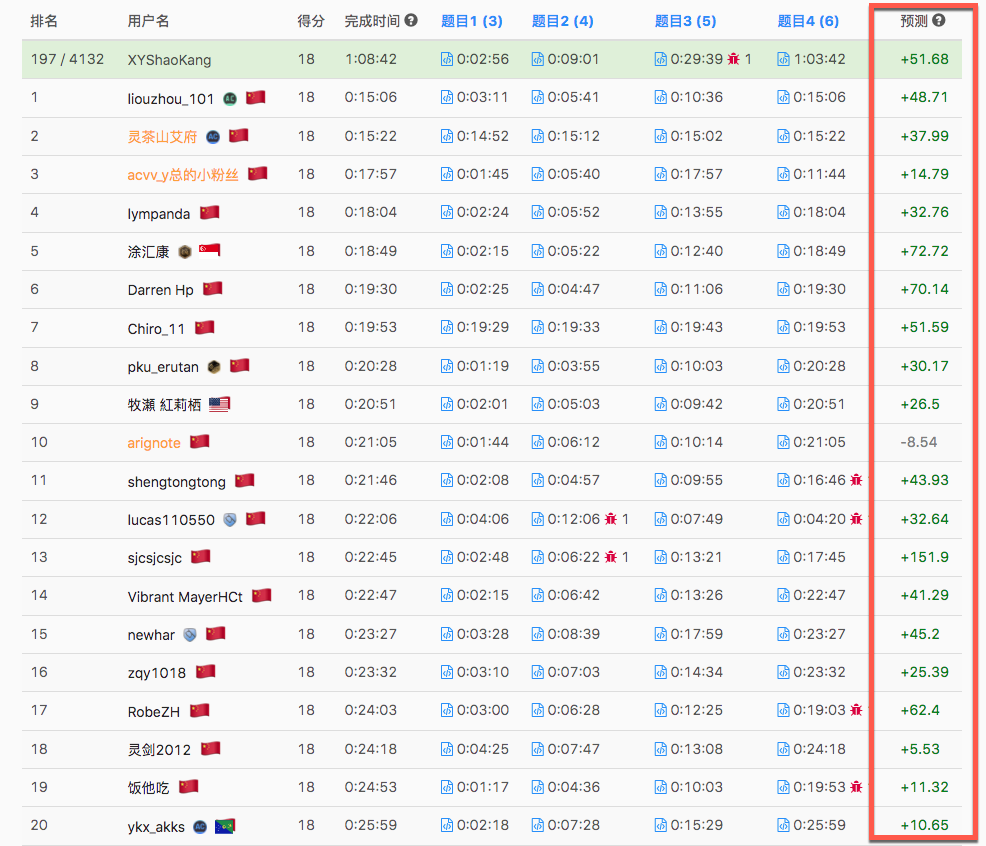

# 力扣扩展

[![semantic-release][semantic-release-image]][semantic-release-url] [![GitHub Action][actions-release-image]][actions-release-url]

[semantic-release-image]: https://img.shields.io/badge/%20%20%F0%9F%93%A6%F0%9F%9A%80-semantic--release-e10079.svg
[semantic-release-url]: https://github.com/semantic-release/semantic-release
[actions-release-image]: https://github.com/XYShaoKang/refined-leetcode/actions/workflows/release.yml/badge.svg?branch=extension
[actions-release-url]: https://github.com/XYShaoKang/refined-leetcode/actions?query=workflow%3ARelease

## 下载

从 https://github.com/XYShaoKang/refined-leetcode/releases 下载最新版本的 refined-leetcode.zip,解压 refined-leetcode.zip

## 安装使用

1. 打开 Chrome 浏览器
2. 转到 chrome://extensions/ 页面
3. 打开页面右上角的开发者模式
4. 点击页面左上角的 `加载以解压的扩展程序` 按钮
5. 选择上面解压的 refined-leetcode 文件夹,再点击确定即可

## 功能

- [答题页计时](#答题页计时)
- [竞赛排名页面显示预测](#竞赛排名页面显示预测)

### 答题页计时

> 2022-01-02 添加

进入答题页时,自动开始计时,第一次提交成功之后会停止计时,并显示所用时间

计时器位于页面右下角,提交和执行代码按钮的左边.

目前提供三种操作,分别是在计时阶段:

提供隐藏时钟的操作


重新显示时钟的操作


以及在结束之后,重新开始的操作


> 2022-01-03 自动添加标记的功能

当成功提交之后,会将当前所有时间自动添加到对应提交的标记中


此功能源码 [src/content/pages/problems](./src/content/pages/problems/)

### 竞赛排名页面显示预测

> 2022-02-24 添加

效果如下,预测数据来自 https://lcpredictor.herokuapp.com/



此功能源码 [src/content/pages/ranking](./src/content/pages/ranking)

## 开发

首先需要安装运行环境 [Node.js](https://nodejs.org/en/download/)(>=v14),以及依赖管理工具 [PNpm](https://pnpm.io/)

> 依赖管理工具可以使用 yarn 或者 npm 替代,下面使用 pnpm 演示

### 下载

```sh
git clone https://github.com/XYShaoKang/refined-leetcode.git
cd refined-leetcode
```

### 安装依赖

```sh
pnpm install
```

### 运行

```sh
pnpm dev
```

### 加载扩展

运行之后会在项目中生成 dist 文件夹,之后进行如下操作

1. 打开 Chrome 浏览器
2. 转到 chrome://extensions/ 页面
3. 打开页面右上角的开发者模式
4. 点击页面左上角的 `加载以解压的扩展程序` 按钮
5. 选择到 dist 路径,再点击确定即可

### 热模块加载

对于 content 的页面开发,已经配置好了热模块加载([Hot Module Replacement](https://webpack.js.org/concepts/hot-module-replacement/))功能,React 组件内的大多数修改应该都能实时反应到页面中,可能有些特殊情况或者是修改 React 外部的代码时,页面会重新加载,不过这些都会自动完成.

如果是需要修改 background 中的代码,保存之后,等待编译完成,需要到扩展页面,手动按刷新按钮才行.
